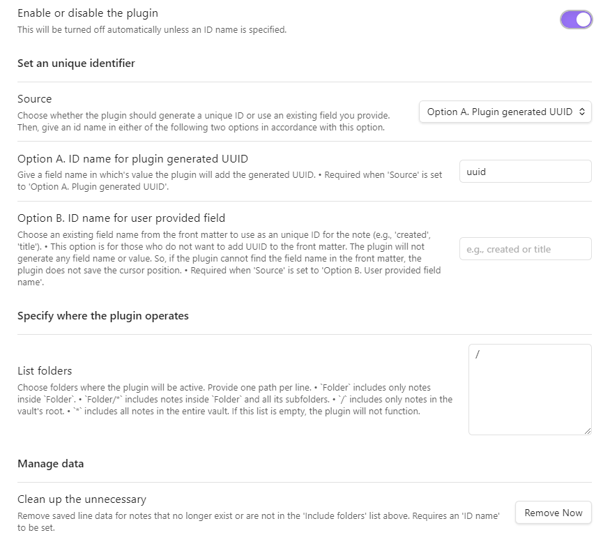

# Last Edit Location, a plugin for obsidian

## what task the plugin carries out

- When a user open a note in obsidian, the plugin moves the cursor to the last edit location.

  - This occurs only once for each note.

  - The plugin is designed to work well with multiple notes.

- To do this, internally

  - the plugin utilizes `unique identifier`, which can be one of `plugin generated UUID`, `user provided field`, or `file path`

  - When editing a note, the plugin stores the note's `unique identifier` as well as the edit line number and character number.

## how a user can use the plugin

### settings tab example

### the format of `unique identifier` in the front matter 

- `{ID name}: {ID}`

### choose `source` option and give an `ID name` for the `unique identifier`

- `Option A. Plugin generated UUID`: If UUID is missing in the front matter, the plugin will automatically generate `UUID` for the note. 
  - The form `unique identifier` will be this: `uuid: xxxxxxxx-xxxx-xxxx-xxxx-xxxxxxxxxxxx`
  - UUID is [version 1 of RFC 9562](https://www.rfc-editor.org/rfc/rfc9562.html#name-uuid-version-1), one using timestamp, with an npm package `uuid` 
- `Option B. User provided field`: A user can choose one of exising field names to use as the `unique identifier`'s name, such as `title` or `createddatetime`. This option will not generate any field name or value but is to offer a flexibility for those who does not want to add additional UUID to the front matter. So, if the plugin cannot find the name of the `unique indentifier` in the front matter, the plugin does not save nor restore the cursor location.
  - The form `unique identifier` will vary according to what a user chooses.
- `Option C. File path`: If a user does not use the front matter, the note's relative path in the vault can be used as its `unique identifier`. This is for those who does not want to use the front matter.

### choose folders where the plugin operates

- `/` means the root of the vault.
- `/*` means the rood and all the sub folders.
- `folder` means the folder in the root.
- `folder/*` means the folder and all its sub folders.

### set restoring delay time

- 10ms to 1000ms, 10ms steps

### remove the unnecessary

- A user can clean up the unnecessary data of location caused by moving notes out from the working folders or deleting them.
- Beware. The stored identifiers other than the current ID set by the above 'source' option will be removed.

### The plugin has two commands (v 0.1.3)
  - `Go to last edit location`
  - `Scroll cursor line to center of view`

## the plugin does not

- trace a user's manual modification of `unique identifier`, any of `UUID` or `user provided field`
  - When under Option B and C, if a user manually changes `unique identifier` of a note, the plugin cannot find it in the stored data.json; which means the plugin will save location with a new `unique identifier`.

## what will be added next
- [x] a command to put the cursor at the last edit position and to scroll the cursor in the vertical center of the view (v 0.1.3)
- [x] a command to scroll the current cursor line to the vertical center of the view (v 0.1.3)

## what will not be added

- an option to store and restore `last navigation location`

## support

- If you like this project, please support. 

## License

MIT
