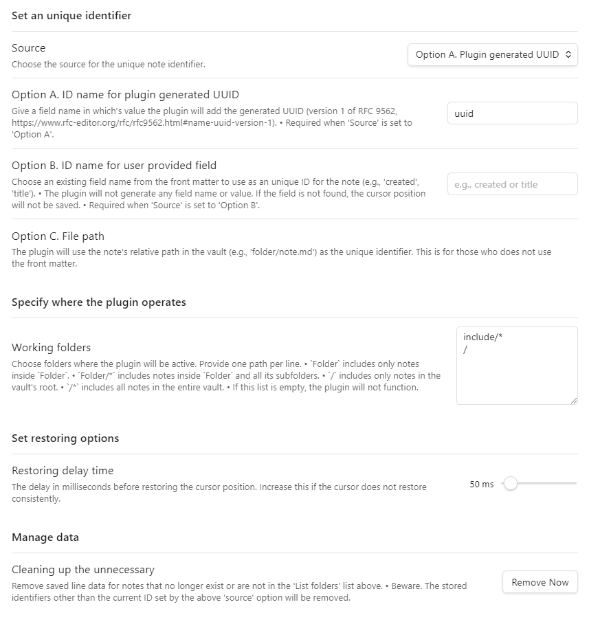

# Last Edit Position, a plugin for obsidian

## what task the plugin carries out

- When a user open a note in obsidian, the plugin moves the cursor to the last edit position.
  - This occurs only once for each note.
- To do this, 
  - the plugin utilize `unique identifier`, which can be either of `plugin generated UUID` or `user provided field`.
  - When opening obsidian or editing a note, the plugin stores the note's `UUID` or `user provided field` as well as the edit line number and character number.
  - When saving the line number and character number, the plugin looks for the `unique identifier` or add one if there's none in the front matter.
- When using `UUID` for the `unique identifier`, the plugin will automatically generate `UUID` if one is missing.
- When using `user provided field`, the plugin will NOT generate anything.

## the format of `unique identifier` in the front matter 
- `{ID name}: {ID}`

## how a user can use the plugin

- turn on the enabling option.
- choose ID source.
- provide ID name according to the ID source option.
- choose folders where the plugin operates.
- if you need, remove unnecessary data from `data.json` file.

### settings tab example

### choose `source option` and give a `ID name` for the `unique identifier`

  - `Option A. Plugin generated UUID`: If UUID is missing in the front matter, the plugin will automatically generate `UUID` for the note. (UUID version 1 of RFC 9562, one using timestamp, with an npm package `uuid`)
    - The form `unique identifier` will be this: `uuid: xxxxxxxx-xxxx-xxxx-xxxx-xxxxxxxxxxxx`
  - `Option B. User provided field`: A user can choose exising field name to use as the `unique identifier`'s name, such as `title` or `createddatetime`. This option will not generate any field name or value but give an flexibility for those who does not want to add additional UUID to the front matter. So, if the plugin cannot find the name of the `unique indentifier` in the front matter, the plugin does not save nor restor the cursor position.
    - The form `unique identifier` will vary according to what a user chooses.

## the plugin does not

- trace a user's manual modification of `unique identifier`, any of `UUID` or `user provided field`
  - When Option B, if a user manually changes `unique identifier` of a note, the plugin cannot find it in the stored data.json; which means the plugin cannot restore the last edit position.

## what will be added next

- an option to choose either `last edit position` or `last navigation position`.
  - a few other old plugins do not work well for the `last navigation position` with multiple notes.

## License

MIT
